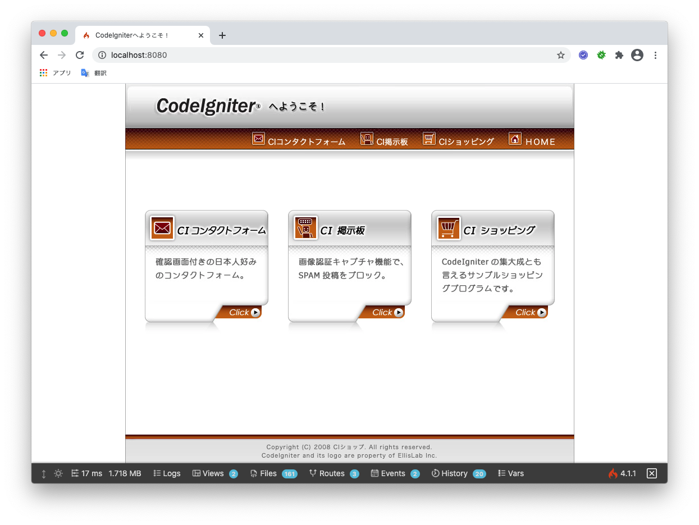
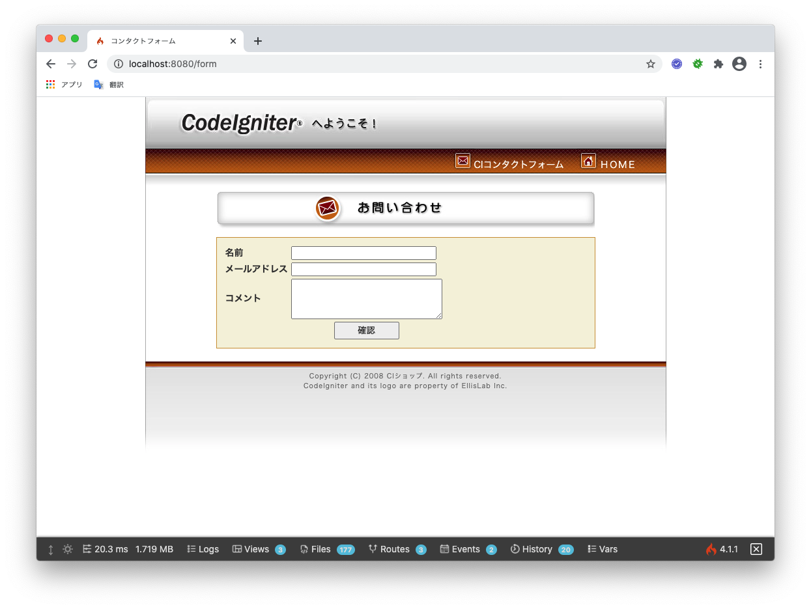
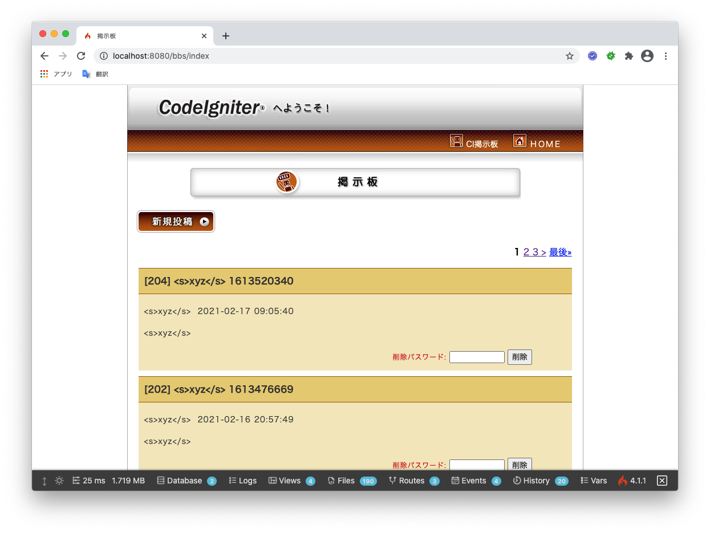
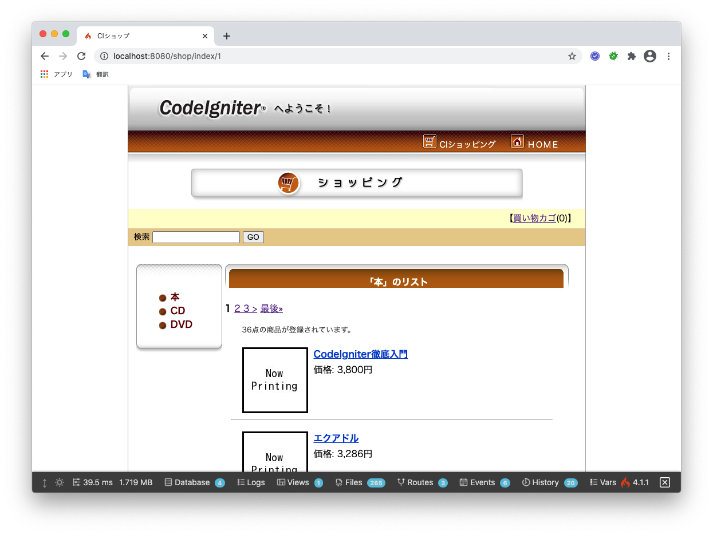

# 『CodeIgniter徹底入門』のサンプルアプリケーションをCodeIgniter4にアップデート

ここは『CodeIgniter徹底入門』（翔泳社）に含まれている以下のサンプルアプリケーション（CodeIgniter 1.6.1用）を [CodeIgniter 3.xで動作するように更新したもの](https://github.com/kenjis/codeigniter-tettei-apps) を、CodeIgniter4で動作するように更新するためのプロジェクトです（作業中）。

- コンタクトフォーム（7章）
- モバイル対応簡易掲示板（8章）
- 簡易ショッピングサイト（9章）

現在、CodeIgniter 4.1で動作するための更新は完了しており、リファクタリングなどを実施中です。

リファクタリング前のコードは、[v4.0.0](https://github.com/kenjis/ci4-tettei-apps/releases/tag/v4.0.0) を参照してください。




## 動作確認環境

- CodeIgniter 4.1.5-dev ([ci4-app-template](https://github.com/kenjis/ci4-app-template) を使用)
- PHP 8.0.10
  - Composer 2.1.6
- MySQL 5.7

## 「CodeIgniter 3.xで動作するように更新したもの」からの変更点

- アプリケーションクラスを名前空間付きに移行
- 設定ファイルを設定クラスに移行 
  - app/Config/ConfigShop.php
- ページネーション
  - 仕様変更に伴い最初のページもURIセグメント数が変わらないものに変更
  - offsetベースからページ番号に移行
  - ページネーションのHTMLをテンプレートに移行
    - App\Views\Pager\default_full
- バリデーション
  - Callableの検証ルールをクラスに移行
    - App\Libraries\Validation\CaptchaRules
  - バリデーションエラーのHTMLをテンプレートに移行
    - App\Views\Validation\list
    - App\Views\Validation\single
- モバイル掲示板用のフックをコントローラフィルタに移行
  - App\Filters\ConvertEncoding
- アプリケーション用の例外クラスを追加
- テストケースクラスを名前空間付きに移行
- 受入テスト用にacceptance環境を追加
  - app/Config/Boot/acceptance.php
- Composerパッケージの更新
  - Twigライブラリをcodeigniter-ss-twig v4.0に更新
  - PHPUnitを9.5に更新
  - symfony/dom-crawlerを5.2に更新
  - symfony/css-selectorを5.2に更新
- GitHub Actionsによるチェックの追加
  - コーディング標準
  - PHPUnit
  - 静的解析

追加されたComposerのパッケージ

- CodeIgniter 3 to 4 Upgrade Helper <https://github.com/kenjis/ci3-to-4-upgrade-helper>
- Ray.Di <https://github.com/Ray-Di/Ray.Di>
- PHPUnit Helper <https://github.com/kenjis/phpunit-helper>
- bear/qatools <https://github.com/bearsunday/BEAR.QATools>

## インストール方法

### ダウンロード

https://github.com/kenjis/ci4-tettei-apps/archive/develop.zip をダウンロードし解凍します。

### .envファイルの作成

```
$ cp env .env
```

### 依存パッケージのインストール

Composerの依存パッケージをインストールします。

```
$ composer install
```

### データベースとユーザーの作成

MySQLにデータベースとユーザーを作成します。

```
CREATE DATABASE `codeigniter` DEFAULT CHARACTER SET utf8mb4;
GRANT ALL PRIVILEGES ON codeigniter.* TO username@localhost IDENTIFIED BY 'password';
```

### データベースマイグレーションとシーディングの実行

データベースにテーブルを作成し、テストデータを挿入します。

```
$ php spark migrate
$ php spark db:seed ProductSeeder
```

## Webサーバーの起動方法

```
$ php spark serve
```

## テストの実行方法

### PHPUnitによるアプリケーションテスト

```
$ composer test
```

テストカバー率のレポートを生成したい場合は、以下を実行します。カバー率の集計にはXdebugが必要です。

```
$ composer coverage
```

レポートは`build/coverage`フォルダに作成されます。

### Codeception/Seleniumによる受入テスト

<https://www.mozilla.org/ja/firefox/new/> よりFirefoxをダウンロードしインストールします。

Homebrewからselenium-server-standaloneとgeckodriverをインストールします。

~~~
$ brew install selenium-server-standalone
$ brew install geckodriver
~~~

Seleniumサーバを起動します。

~~~
$ selenium-server -port 4444
~~~

受入テストを実行します。

~~~
$ sh acceptance-test.sh
~~~

#### Note

geckodriverが開けない場合は、一度Finderからgeckodriverを右クリックして開いてください。

参考: https://github.com/mozilla/geckodriver/issues/1629#issuecomment-650432816

## ライセンス

サンプルアプリケーションのライセンスは「修正BSDライセンス」です。詳細は、[LICENSE.md](LICENSE.md) をご覧ください。

## 謝辞

サンプルアプリケーションのデザインは、神野みちるさん（株式会社ステップワイズ）にしていただきました。

## 『CodeIgniter徹底入門』について

- [『CodeIgniter徹底入門』のサンプルアプリケーションをCodeIgniter 3.xにアップデート](https://github.com/kenjis/codeigniter-tettei-apps)
- [『CodeIgniter徹底入門』情報ページ](http://codeigniter.jp/tettei/)
- [『CodeIgniter徹底入門』に対するノート](https://github.com/codeigniter-jp/codeigniter-tettei-note)
